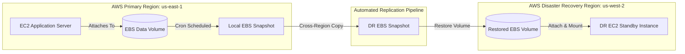

# ☁️ AWS Multi-Region Disaster Recovery & Automated Failover Architecture

An enterprise-grade AWS disaster recovery strategy engineered to ensure business continuity across regional cloud outages. This architecture implements automated EBS volume snapshotting, cross-region replication, and failover validation to meet strict Recovery Point Objectives (RPO) and Recovery Time Objectives (RTO).

---

## 📐 Architecture Diagram

⚡ Key Metrics & DR TargetsRecovery Point Objective (RPO): $< 15$ minutes (Automated EBS snapshot replication cycle).Recovery Time Objective (RTO): $< 30$ minutes (Automated EBS volume restore and attachment).Availability Target: Designed for $99.9\%$ service resilience during primary region downtime.Failure Coverage: EC2 host crashes, EBS volume corruption, and complete AWS regional failures.

📁 Repository StructurePlaintext.
├── README.md                   # Technical documentation
├── scripts/
│   ├── ebs_snapshot_backup.sh  # Local EBS snapshot automation
│   ├── cross_region_copy.py    # Boto3 script for cross-region replication
│   └── dr_failover_restore.sh  # Disaster recovery restore & mounting script
├── config/
│   └── dr_policy.json          # IAM permissions & backup policies
└── docs/
    └── architecture_spec.md    # Detailed failover specification

🛠️ Tech Stack & PrerequisitesCloud Services: AWS (EC2, EBS Snapshots, IAM, S3, CloudWatch)Scripting & Automation: Bash, Python 3 (boto3), CrontabOperating System: RHEL / Ubuntu Server / Kali LinuxPrerequisites:AWS CLI installed and configured with appropriate IAM access keys.Python 3.8+ with the boto3 SDK installed:Bashpip install boto3
IAM policy configured with permissions for ec2:CreateSnapshot, ec2:CopySnapshot, and ec2:AttachVolume.🚀 Deployment & Operations Guide1. Clone the RepositoryBashgit clone [https://github.com/Sumbulzahra/aws-disaster-recovery-architecture-project.git](https://github.com/Sumbulzahra/aws-disaster-recovery-architecture-project.git)
cd aws-disaster-recovery-architecture-project

2. Configure Local Backup Schedule (Primary Region)Make the backup script executable and configure a system cron job to run automated snapshot routines:Bashchmod +x scripts/ebs_snapshot_backup.sh
crontab -e
Add the following entry to run backups every 15 minutes:Code snippet*/15 * * * * /bin/bash /path/to/aws-disaster-recovery-architecture-project/scripts/ebs_snapshot_backup.sh >> /var/log/ebs_dr.log 2>&1

3. Execute Cross-Region ReplicationRun the Python replication script to copy the latest primary snapshot (us-east-1) to your designated DR region (us-west-2):Bashpython3 scripts/cross_region_copy.py --source-region us-east-1 --target-region us-west-2

4. Trigger Disaster Recovery Failover (DR Region)In the event of a regional outage or primary data volume failure, execute the automated restore sequence in the DR region:Bashchmod +x scripts/dr_failover_restore.sh
./scripts/dr_failover_restore.sh --region us-west-2 --instance-id i-xxxxxxxxxxxxxxxxx
📊 Verification & Health ChecksVerify volume integrity and snapshot status via AWS CLI commands:Bash# Verify snapshots in Primary Region
aws ec2 describe-snapshots --owner-ids self --region us-east-1 --query 'Snapshots[*].[SnapshotId,StartTime,State]'

# Confirm cross-region snapshot replication in DR Region
aws ec2 describe-snapshots --owner-ids self --region us-west-2 --query 'Snapshots[*].[SnapshotId,StartTime,State]'
📄 License & ContactDistributed under the MIT License. Built and maintained by Sumbul Zahra.
