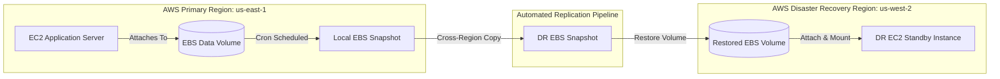

# ☁️ AWS Multi-Region Disaster Recovery & Automated Failover Architecture

An enterprise-grade AWS disaster recovery strategy engineered to ensure business continuity across regional cloud outages. This repository contains production-ready scripts for automated EBS snapshotting, cross-region replication, and failover restoration alongside complete technical specifications.

---

## 📐 Architecture Diagram

---

## 📂 Repository StructurePlaintextaws-disaster-recovery-architecture-project/
├── README.md                   # Main technical overview & deployment guide
├── docs/                       # Architectural specifications & recovery procedures
│   └── architecture_spec.md    # Failover mechanics & recovery objectives
└── scripts/                    # Automation scripts
    ├── ebs_snapshot_backup.sh  # Automated local EBS snapshot generation
    ├── cross_region_copy.py    # Python/Boto3 cross-region snapshot replication
    └── dr_failover_restore.sh  # Disaster recovery volume restoration & mounting

---

## ⚡ Key Metrics & DR Targets
Recovery Point Objective (RPO): $< 15$ minutes (Automated snapshot replication cycle).
Recovery Time Objective (RTO): $< 30$ minutes (Automated EBS volume restore and attachment).
Availability Target: Designed for $99.9\%$ service resilience during primary region downtime.
Failure Scenarios Handled: Instance failure, data volume corruption, and complete regional outages.

---

## 🛠️ Tech Stack & Prerequisites
Cloud Infrastructure: AWS (EC2, EBS Snapshots, IAM, S3)
Automation & Tools: Bash, Python 3 (boto3), Crontab
OS Environment: RHEL / Ubuntu / Linux
Prerequisites:
1 AWS CLI installed and configured with proper IAM credentials.
2 Python 3.8+ with the boto3 library installed: Bash pip install boto3
3 IAM policies attached granting permissions for ec2:CreateSnapshot, ec2:CopySnapshot, and ec2:AttachVolume.

---

## 🚀 Execution & Operating Guide
### 1. Clone the RepositoryBashgit clone [https://github.com/Sumbulzahra/aws-disaster-recovery-architecture-project.git](https://github.com/Sumbulzahra/aws-disaster-recovery-architecture-project.git)
cd aws-disaster-recovery-architecture-project

### 2. Configure Automated Backups (scripts/) 
Make the script executable and set up a local cron job to automate backups:Bashchmod +x scripts/ebs_snapshot_backup.sh
crontab -e
Add a cron entry to trigger backups every 15 minutes:Code snippet*/15 * * * * /bin/bash /path/to/aws-disaster-recovery-architecture-project/scripts/ebs_snapshot_backup.sh >> /var/log/ebs_dr.log 2>&1

### 3. Replicate Snapshots Across Regions (scripts/)
Execute the Python replication script to copy primary snapshots (us-east-1) to your recovery region (us-west-2):Bashpython3 scripts/cross_region_copy.py --source-region us-east-1 --target-region us-west-2

### 4. Trigger Disaster Recovery Failover (scripts/)
In the event of an outage, run the recovery script to restore the volume in the DR region:Bashchmod +x scripts/dr_failover_restore.sh
./scripts/dr_failover_restore.sh --region us-west-2 --instance-id i-xxxxxxxxxxxxxxxxx

---

## 📖 Technical Documentation

For in-depth operational design, failure scenarios, and architectural decisions, refer to the full specification inside the `docs/` folder:
- 📄 **[Architecture Specification File](./docs/architecture_spec.md)**

---

## 📄 License & Maintainer

Distributed under the **[MIT License](./LICENSE)**. Developed and maintained by **[Sumbul Zahra](https://github.com/Sumbulzahra)**.
